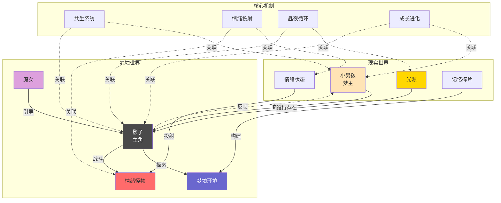

# 《影梦》(Silhouette Dream) 概念关系图

本文档以可视化方式展示游戏核心概念之间的关系。

---

## 核心概念关系图

---

## 概念关系说明

| 关系类型 | 描述 |
|---------|------|
| **寄生关系** | 影子依附于小男孩（梦主）存在，两者共生 |
| **光依赖** | 影子需要光源维持自我意识，黑暗中会消逝 |
| **情绪投射** | 现实中的情绪具象化为梦境中的怪物 |
| **记忆构建** | 记忆碎片重组形成梦境场景 |
| **魔女引导** | 魔女作为引导者，推动影子探索真相 |
| **昼夜循环** | 白天现实/夜晚梦境的交替机制 |
| **双向成长** | 梦境战斗经验影响现实，现实状态影响梦境能力 |

---

## 层次结构说明

### 现实层
现实世界的核心元素，是梦境世界的"因"。

| 元素 | 作用 |
|-----|------|
| 小男孩（梦主） | 影子的宿主，梦境的创造者 |
| 光源 | 维持影子存在的必要条件 |
| 情绪状态 | 影响梦境内容和怪物生成 |
| 记忆碎片 | 构建梦境场景的基础素材 |

### 梦境层
影子活动的舞台，是现实世界的"果"。

| 元素 | 作用 |
|-----|------|
| 影子（主角） | 玩家操控角色，在梦境中冒险战斗 |
| 梦境环境 | 由记忆构建的随机生成关卡 |
| 情绪怪物 | 负面情绪具象化的敌人 |
| 魔女 | 引导影子探索的神秘存在 |

### 核心机制
连接现实与梦境的系统规则。

| 机制 | 说明 |
|-----|------|
| 共生系统 | 影子与宿主的依存关系 |
| 情绪投射 | 现实情绪→梦境实体的转化机制 |
| 昼夜循环 | 现实/梦境的时间切换机制 |
| 成长进化 | 双向影响的能力提升系统 |

---

**关联文档**：[概念设定.md](概念设定.md)（本文档的父文档）

*注：本文档为《影梦》(Silhouette Dream) 游戏的概念关系图。*
